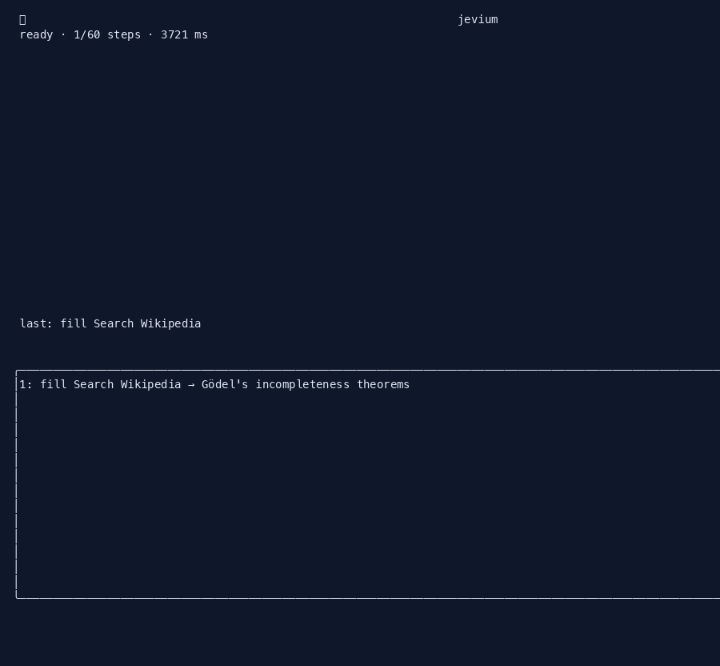

# Jevium

Give Jevium a site and a natural-language task. It runs a browser agent on a self-managed Chromium and pauses for human intervention when a CAPTCHA, payment, OTP, login, or low-confidence decision appears.



The TUI shows agent state, the current/active step, completed steps, and human-intervention prompts only. The browser remains a separate visible window for human intervention.

## Quickstart

```bash
git clone https://github.com/Mu99Ti/jevium.git
cd jevium
uv sync
uv run playwright install chromium
cp .env.example .env
# Add TYPESAFE_API_KEY. Add TEXT_MODEL_API_KEY for TYPE_TEXT, planner, and verifier.
uv run jevium run --url https://example.com --task 'Open the More information link'
```

Plain logs are available with `--plain`:

```bash
uv run jevium run --plain \
  --url https://en.wikipedia.org/wiki/Main_Page \
  --task "Find and open the Wikipedia article about Gödel's incompleteness theorems."
```

A raw terminal capture from that TUI run is in [`docs/tui-sample.txt`](docs/tui-sample.txt).

## What it does

Jevium keeps the loop small: page observation produces indexed elements, one model request chooses an operation and its matching target, and execution rechecks freshness before mutation.

```text
goal + page snapshot
        │
        ▼
one TypeSafe request
  operation + target heads + human_intervention
        │
        ▼
gates A-D ──► waiting_human ──► Resume
        │
        ▼
observe → choose → act → verify final outcome
```

No site-specific plans or hardcoded field values are added. Model output never becomes selectors, coordinates, shell commands, or executable JavaScript.

## Human-in-the-loop

A run pauses in `waiting_human` for one of these reasons:

- **A:** the model chose `NEEDS_HUMAN`
- **B:** speculative `human_intervention` says a person is required
- **C:** confidence is below `JEVIUM_MIN_CONFIDENCE`
- **D:** the selected target is a payment action

The TUI shows the reason and a **Resume** button. Plain mode prompts on stdin and resumes on Enter. The visible browser window is where the human completes the step.

## CLI

```bash
jevium run --url <URL> --task '<goal>' \
  [--plain] [--headless] [--profile <name>] [--record] \
  [--backend chromium|harness] [--max-steps N]
```

- `--plain`: line logs instead of the TUI
- `--headless`: headed is the default so a human can intervene
- `--profile <name>`: persistent Chromium profile under `~/.jevium/profiles/`
- `--record`: save screenshots and `steps.jsonl` under `runs/<timestamp>/`
- `--backend chromium|harness`: default is self-managed Chromium
- `--max-steps N`: browser mutation budget; default comes from the agent

Exit codes: `0` done, `1` blocked or failed, `2` usage/config error, `130` interrupt.

## Environment

```bash
cp .env.example .env
```

Required:

- `TYPESAFE_API_KEY`
- `TEXT_MODEL_API_KEY` for `TYPE_TEXT`, planner, and verifier

Optional:

- `TEXT_MODEL_BASE_URL`
- `TEXT_MODEL`
- `TEXT_MODEL_REASONING`
- `PLANNER_MODEL`
- `JEVIUM_MIN_CONFIDENCE`

## Development

```bash
uv run ruff check .
uv run pytest -q
node --check jevium_core/snapshot.js
node --check jevium_core/static/app.js
uv build
```

## License

MIT. See [`LICENSE`](LICENSE).
